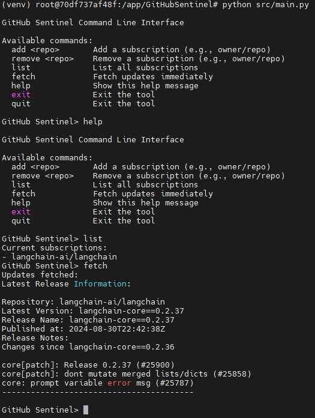

# 作业（2024.8.14）
1. Star & Clone & Fork 课程项目：agent-hub（ https://github.com/DjangoPeng/agent-hub ） 与 GitHubSentinel（ https://github.com/DjangoPeng/GitHubSentinel ） ，并成功运行 GitHubSentinel v0.1 版本。  

1. 参考 ChatGPT 对话历史《GitHub AI Agent Strategy》（ https://chatgpt.com/share/5236d6bb-334d-4670-bc6d-918276490599 ）。新建一个 ChatGPT 聊天对话，实现类似的研发计划表和版本排期。  
**ArXiv Sentinel Development Guide**: https://chatgpt.com/share/e40c2c60-fda1-49f4-bd0e-267b46ee2b4e

1. 参考 ChatGPT 对话历史《GitHub Sentinel 技术实现》 （ https://chatgpt.com/share/d9b4c3f3-2594-4541-a4a6-e13b3d505ffa ）。 新建一个 ChatGPT 聊天对话，实现 GitHub Sentinel v0.0.1 版本近似功能。  
**ArXiv Sentinel Code Structure**: https://chatgpt.com/share/530b7d61-01b4-4e50-892c-97bcc39133b3